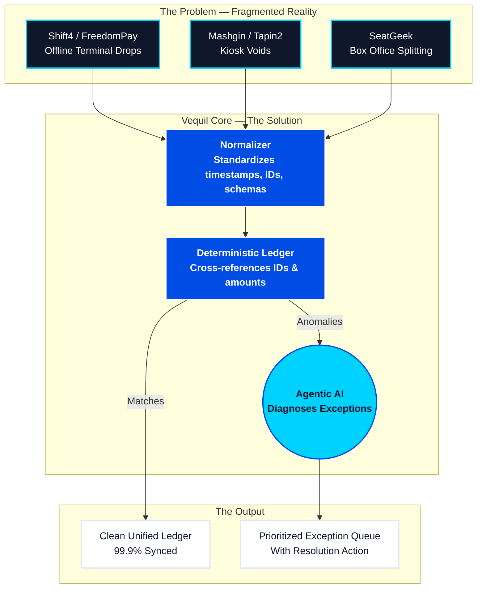

# Vequil Pitch Deck
**The Agentic Recon Engine**

---

## Visual Infographic: The Data Flow

The diagram below instantly communicates the core problem and solution. Use this in early slides or as leave-behind materials.

---

## Slide-by-Slide Deck Structure

### Slide 1 — Title
**Headline:** Vequil — The Agentic Recon Engine
**Sub-headline:** Eliminating the multi-day reconciliation nightmare for massive live events.
**Visual:** Clean dashboard screenshot showing real-time ledger sync.

---

### Slide 2 — The Wedge (The Hardest Problem First)
**Headline:** Stadiums are the most hostile transaction environment on earth.

**Talking Points:**
- Massive spikes in transaction density — 70,000 fans buying beer at halftime in under 20 minutes.
- No standard POS stack: ticketing on SeatGeek, merch on Shift4, food on Mashgin computer vision kiosks.
- Heavy reliance on *offline batching* due to concrete stadium bowls destroying Wi-Fi coverage.

**The Pain:** Finance teams spend 3+ days manually stitching CSVs to answer "why are we short $45,000 tonight?"

---

### Slide 3 — The Vequil Engine
**Headline:** Deterministic Logic meets Agentic AI.

**How it works:**
1. **Ingest & Normalize** — We take dirty exports from every processor in your stack and force them into one schema, regardless of column names, timestamps, or batching windows.
2. **Deterministic Match** — Our engine cross-references every transaction instantly. 99% of transactions clear automatically, zero ambiguity.
3. **Agentic Diagnosis** — For exceptions (e.g., "Row 45 doesn't match Row 12"), our AI Agent analyzes the metadata, explains *why* it happened in plain English (e.g., "Terminal 14 lost sync during halftime rush"), and tells the operator exactly how to fix it.

---

### Slide 4 — Real Proof (Traction)
**Headline:** Battle-tested on simulated peak loads.

**Talking Points:**
- Engine handles 25,000+ localized stadium transactions across Shift4, FreedomPay, and Amazon JWO.
- Catches injected shrinkage discrepancies ($800+ variance in a single Amazon JWO kiosk location).
- Identifies 50+ dropped offline terminal syncs from Shift4 and auto-generates resolution actions per terminal.
- What used to take 3 days of spreadsheet hacking now runs in **under 5 minutes**.

---

### Slide 5 — The Grand Vision (Agentic Economy)
**Headline:** Stadiums are just the Proving Ground.

**The Big Picture:**
- If you can build infrastructure rigorous enough to reconcile a hybrid offline/online stadium in real-time...
- You've built the perfect financial settlement layer for the **Agentic Economy**.
- As B2B transactions increasingly move from human-driven clicks to machine-driven API calls, legacy accounting software fails. It was built for humans.
- Vequil is building the engine that will reconcile the autonomous future — the financial middleware layer for machine-to-machine commerce.

**The Arc:** Live Events → Omnichannel Retail → Agentic Economy Settlement Layer

---

### Slide 6 — The Ask & Milestones
**Headline:** Our Next 12 Months.

| Milestone | Timeline | Status |
|---|---|---|
| Core engine + AI agent scoped and simulated | Now | ✅ Done |
| Live pilot with Chicago Cubs / stadium partner | Summer 2026 | 🔜 Upcoming |
| Expand integrations: SeatGeek, Tapin2, Mashgin API | Fall 2026 | Planned |
| First paid venue contract | End of 2026 | Target |

**The Ask:** Seed funding to accelerate live integration work and hire one senior data engineer.
