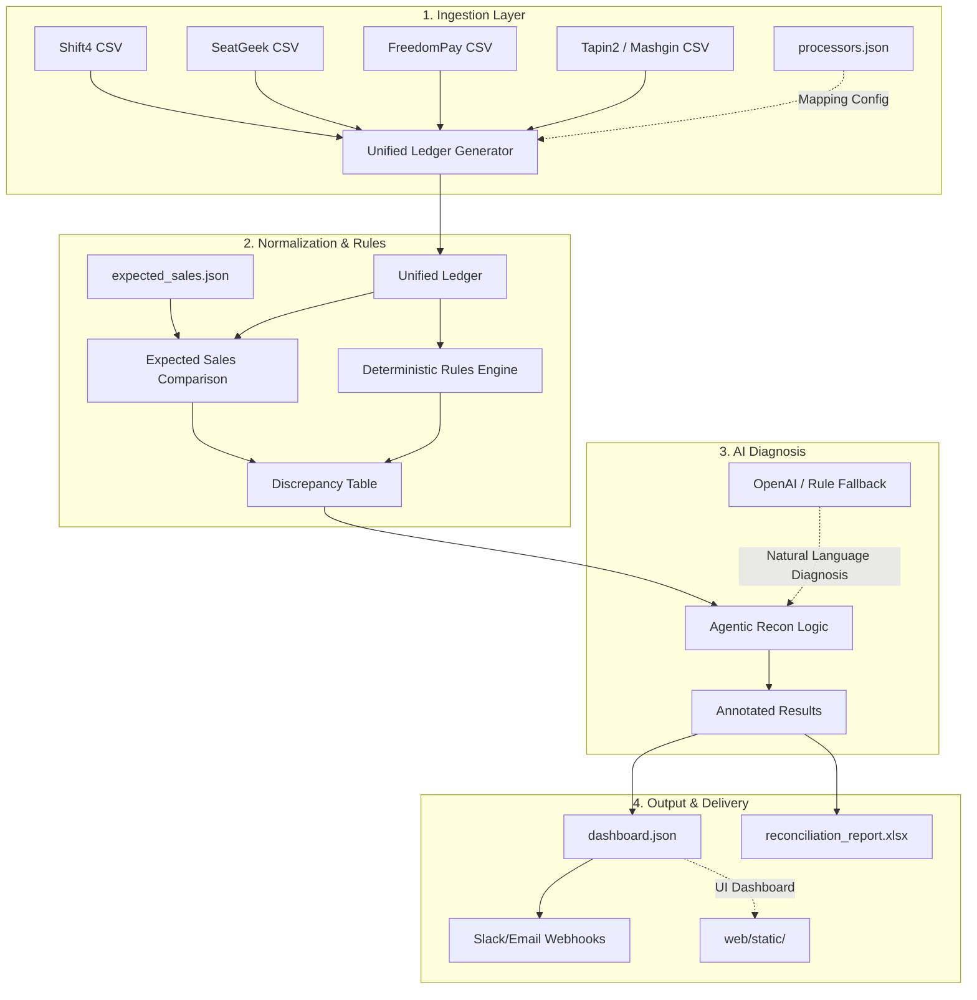

# Vequil Architecture: The Agentic Recon Engine

This document provides a high-level technical map of the Vequil pipeline for enterprise stakeholders. It explains how fragmented stadium payment data is transformed into actionable, AI-driven reconciliation findings.

## Data Flow Overview

## Component Deep-Dive

### 1. Ingestion & Normalization (`normalizers.py`)
Stadiums use multiple payment vendors that export data in non-standard formats with conflicting timezone settings. 
- **Mapping:** Uses `configs/processors.json` to dynamic-link heterogeneous columns (e.g., `Order_ID` vs. `Ref_Num`) to a global schema.
- **Clock Drift Correction:** Standardizes all timestamps (UTC, Eastern, Pacific) to the specific venue's local timezone to prevent settlement cutoff errors.

### 2. Expected Sales vs. Settlement (`expected_sales.py`)
The engine cross-references "Expected Sales" (from POS or Ticketing software) against the "Unified Ledger" (what actually hit the bank).
- **Variance Detection:** Flags areas where expected revenue is missing from settlements (e.g., terminal offline) or where settlements don't have a matching POS record (e.g., double-charging).

### 3. Deterministic Rules (`rules.py`)
Before AI ever sees the data, a high-performance rules engine flags:
- **Missing Auth Codes:** Transactions that weren't properly authorized by the bank.
- **Duplicate References:** Intentional or accidental double-swipes.
- **Unsettled Status:** Transactions stuck in "Pending" longer than the 24h window.

### 4. Agentic Diagnosis (`agent.py`)
The engine pipes the deterministic findings into an AI agent. The AI uses its understanding of stadium operations to explain *why* an anomaly happened.
- **Root Cause Analysis:** "Shift4 terminal failed to sync its offline batch during halftime."
- **Actionable Steps:** "Force a manual sync on Terminal #45 or check the network hub in Concourse B."

### 5. Delivery Layer (`server.py` & `pipeline.py`)
Results are surfaced in a high-density, glassmorphic dashboard for finance teams, or exported as a multi-sheet Excel file for official accounting audits.